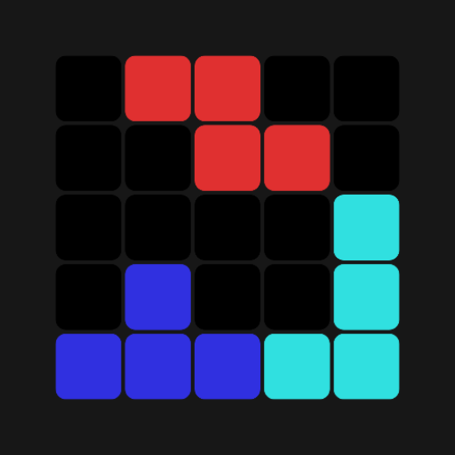

<!--suppress ALL -->

    
    <h1>Tetramine</h1>
    
The mobile modern version of tetris

    

        
    

### Tetramine
This is the mobile modern version of tetris

Classic arcade puzzle game where you have to stack falling tetromino — 4-block pieces, create solid lines out of them and play for the score
The original mechanics are retained here, with smooth controls, but with a modern, minimalist design

### Feature
- [ ] Modern Material Design 3
- [ ] MVVM, ViewModel